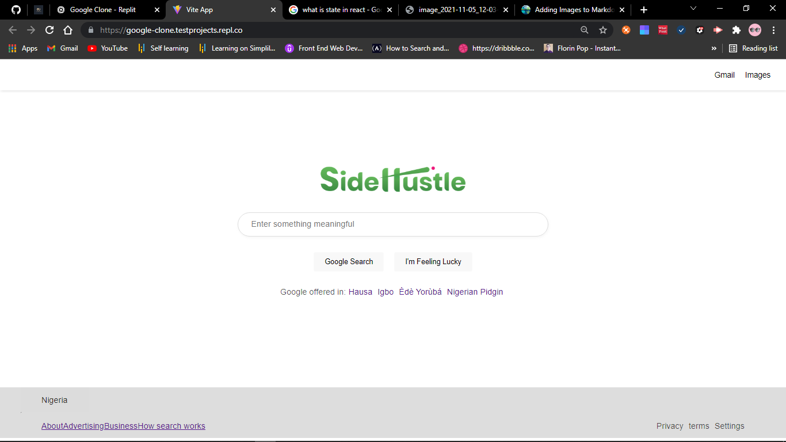

# SideHustle Internship
## Team MEDICS - Google clone with ReactJs Library
### Welcome! 👋

This is a solution to the [Google clone with ReactJs Library by Team Medics](https://www.frontendmentor.io/challenges/sunnyside-agency-landing-page-7yVs3B6ef).

**To do this challenge, you need a basic understanding of HTML, CSS, JavaScript and React**

## Table of contents

- [Overview](#overview)
  - [The challenge](#the-challenge)
  - [Video](#video)
  - [Links](#links)
- [The process](#the-process)
  - [Built with](#built-with)
  - [What I learned](#what-i-learned)
  - [Continued development](#continued-development)
  - [Useful resources](#useful-resources)
  - [Where to find everything](#where-to-find-everything)
  - [Building your project](#building-your-project)
  - [Deploying your project](#deploying-your-project)
- [Author](#author)
- [Acknowledgments](#acknowledgments)

## Overview



### The challenge

1. Use React Js
2. Provide a useable experience across all modern web browsers and users who require assistive technologies .
3. Recreate the Google homepage [Google](https://www.google.com/)
4. Replace the Google Logo with SideHustle logo
5. When a user types in the search input field, update the SideHustle logo to the value in the input field.
6. When the input field is empty, display the logo again

### Video


### Links

- Solution URL: [https://github.com/testprojcts/team-medics-google-clone](https://github.com/testprojcts/team-medics-google-clone)
- Live Site URL: [Google Clone](hosted link)

## The process

### Built with

- Semantic HTML5 markup
- CSS custom properties
- Flexbox
- [React](https://reactjs.org/) - JS library

### What we learned

We learned how to build UI with React and update the state.

### Continued development

We want to focus more on State management and debugging.

### Useful resources

- [State Hooks](https://reactjs.org/docs/hooks-state.html) - This helped with the syntax and how to apply it to a function.

## Where to find everything

The components are in the components folder in the src folder.
You will find all the required assets in the `/images` folder. The assets are already optimized.

## Building your project

1. Initialize your project
```
npx create-react-app appName
cd appName
npm start
```
2. Edit the files you want to and it updates on the localhost.

## Deploying your project

- [Vercel](https://vercel.com/)
- [Netlify](https://www.netlify.com/)

## Authors

- [Miracle Ogunleye](https://github.com/mimiicodes)
- [Erasmus Mensah](https://github.com/testprojcts)
- [Ngozi Aguluka](https://github.com/Melissacinta)

## Acknowledgements

The entire family of SideHustle Internship React 4.0 🎊✨

**Have fun building!** 🚀
